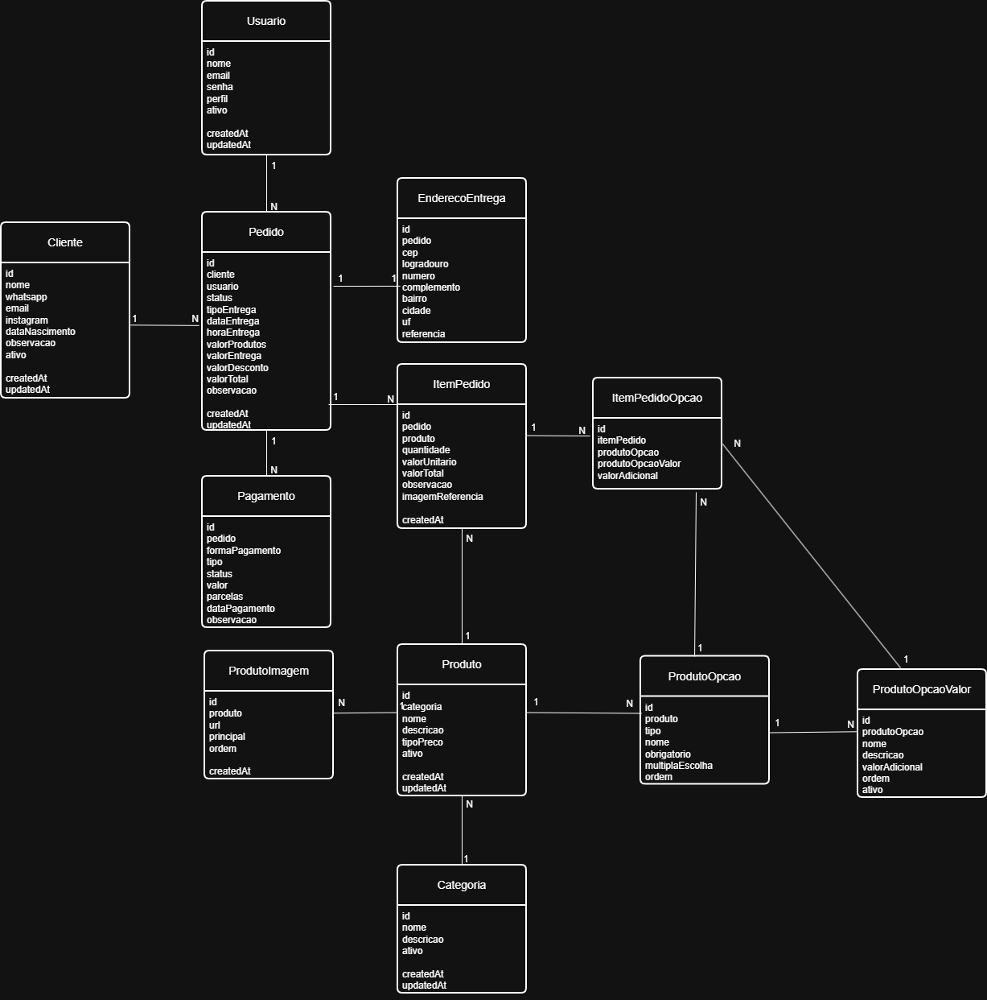

# Ateliê Rita Lara

Sistema web para gerenciamento de pedidos, produção e catálogo de produtos do Ateliê Rita Lara.

## Objetivo

Centralizar todo o processo de atendimento da confeitaria, permitindo que clientes realizem pedidos online e que a administração gerencie produtos, clientes, pedidos e produção em um único sistema.

## Tecnologias

### Backend

- Java 21
- Spring Boot
- PostgreSQL
- Spring Security
- JWT
- Flyway
- Swagger

### Frontend

- React
- TypeScript
- Vite
- Axios
- React Query

## Ambientes

| Ambiente | Branch |
|----------|--------|
| Homologação | develop |
| Produção | main |

## Estrutura

backend/

frontend/

docs/

docker/

.github/

## Modelo de Domínio

